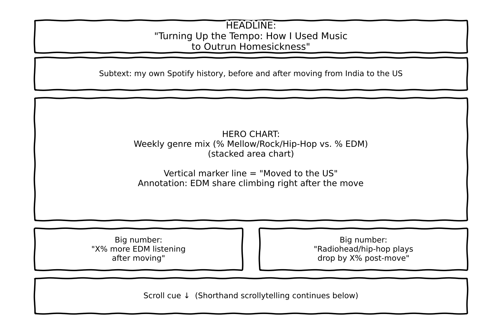
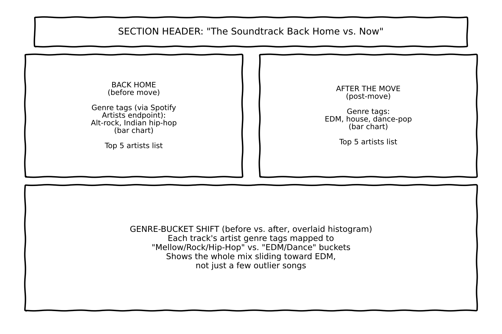
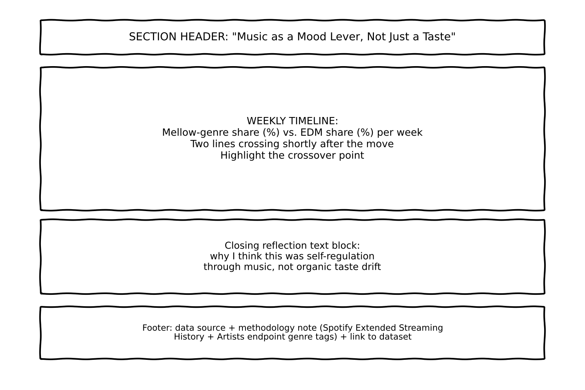

| [home page](https://cmustudent.github.io/tswd-portfolio-templates/) | [data viz examples](dataviz-examples) | [critique by design](critique-by-design) | [final project I](final-project-part-one) | [final project II](final-project-part-two) | [final project III](final-project-part-three) |

> Important note: this template includes major elements of Part I, but the instructions on Canvas are the authoritative source.  Make sure to read through the assignment page and review the rubric to confirm you have everything you need before submitting.  When done, delete these instructions before submitting.

# Outline

**One-sentence summary:** Within months of moving from India to the United States, my Spotify history shows a deliberate shift away from moody, mellow genres — Radiohead-style alternative rock and the Indian hip-hop scene I'd been embedded in — toward high-energy EDM, a change I made on purpose to keep myself from sinking into homesickness.

This project uses my own Spotify listening history to tell the story of a coping mechanism I didn't fully notice until I looked at the data: after moving from India to the US, I actively steered my listening away from the mellow, introspective music I loved back home — Radiohead and similar alt-rock, plus the Indian hip-hop scene I was closely following — toward high-energy EDM. It wasn't that my taste changed; it was a decision, made mostly unconsciously in the moment, to keep my mood up rather than let quieter, more reflective music pull me into homesickness. I want to show that shift as concrete, timestamped evidence rather than just a feeling I remember having.

The story isn't really about EDM or about Radiohead — it's about the fact that a small, everyday habit like a music queue can be a mood-regulation tool, and that you can actually see someone using it that way if you look closely enough at their own data.

Following the story-structure ideas from *Good Charts* (Ch. 8), this is a three-act arc:

1. **Setup — "The Soundtrack Back Home."** Establish the baseline: heavy rotation of Radiohead-adjacent alt-rock and the Indian hip-hop scene before the move.
2. **The Change — "Landing, and Turning Up the Tempo."** Mark the move on a timeline; show the shift toward EDM starting shortly after.
3. **Resolution — "Music as a Mood Lever, Not Just a Taste."** Reflect on what the shift reveals — that this was self-regulation through music, not organic taste drift.

**User story:** As someone who has also moved somewhere far from home, I want to see how a real person used a small, everyday habit (like their music choices) to manage a big emotional transition, so I can recognize the same coping patterns in my own life.

**Story arc detail:**
- **Hook:** a single specific stat (e.g., "EDM went from X% to Y% of my listening within N weeks of landing") to pull the reader in before any explanation.
- **Rising action:** the before/after comparison panels (genre mix, top artists).
- **Climax:** the weekly crossover chart, showing the exact point EDM overtook mellow genres, annotated with what was happening in my life at that time.
- **Resolution:** a short, honest reflection on why I think this was a deliberate mood lever rather than a coincidence.

> A project structure that outlines the major elements of your story.  Your Good Charts text talks about story structure in Chapter 8 - you should describe what you hope to achieve.  Make sure the outline is detailed enough that we can see how you anticipate your story unfolding.  You can incorporate your Story Arc from the in-class exercise along with your user stories and one sentence summary to make the topic even more clear. 

Text here...

## Initial sketches

The three sketches below lay out the major sections of the scrollytelling piece, in the order a reader would move through them. They're intentionally low-fidelity — the goal is to lock in structure and content, not visual polish.

**Sketch 1 — Landing / Hero section:** headline, a hero chart of weekly genre mix with the move date marked, and two "big number" callouts.

**Sketch 2 — Before/After comparison:** side-by-side "Back Home" vs. "After the Move" panels (genre breakdown + top artists), followed by a before/after genre-bucket distribution.

**Sketch 3 — Closing / reflection:** a weekly crossover timeline (mellow share vs. EDM share), a closing reflection text block, and a footer with data source and methodology notes.

# The data

My primary data source is my own **Spotify Extended Streaming History**, requested from Spotify (Account → Privacy Settings → "Request my data" → select "Extended streaming history"). It includes, for every track I've played: track name, artist name, a full timestamp, and milliseconds played — enough to build a real before/after comparison around my move date. I'll pair this with Spotify's `/v1/artists` API endpoint to pull each artist's genre tags, grouping them into "Mellow/Rock/Indian Hip-Hop" vs. "EDM/Dance" buckets to chart the shift over time. The full export can take a few weeks to arrive, so the placeholder file below stands in for now, alongside a real sample of my 50 most recent plays.

| Name | URL | Description |
|------|-----|-------------|
| Placeholder streaming history | [data/placeholder_streaming_history.csv](data/placeholder_streaming_history.csv) | Stands in for the real export until it arrives |
| Recent plays sample | [data/recently_played_sample.csv](data/recently_played_sample.csv) | Real sample pulled from my own account via the Spotify API |
| Script used to pull the sample | [data/get_recent_tracks.py](data/get_recent_tracks.py) | Script I ran against my own account to generate the sample above |

# Method and medium

I plan to build this as an interactive, scrollytelling-style piece in **Shorthand**, with the data visualizations built in **Tableau** and embedded directly into the Shorthand narrative. Tableau will handle the weekly genre-mix stacked area chart, the before/after genre-bucket comparison, and the crossover timeline; Shorthand will carry the narrative text, section transitions, and the headline/big-number moments from the sketches above.

## References

Duarte, Scott. *Good Charts*. Harvard Business Review Press.

## AI acknowledgements

I used AI to help me think through this proposal. 
